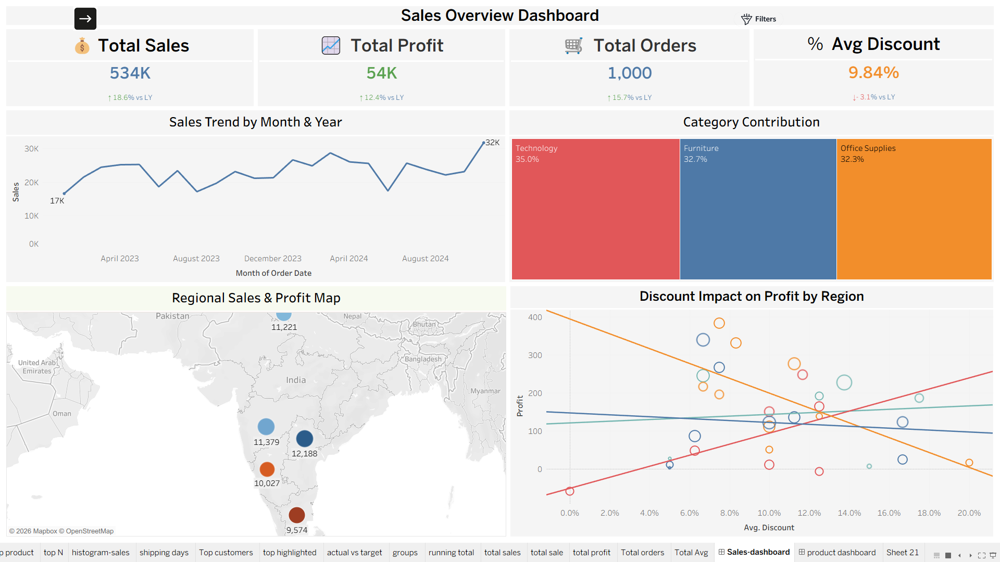
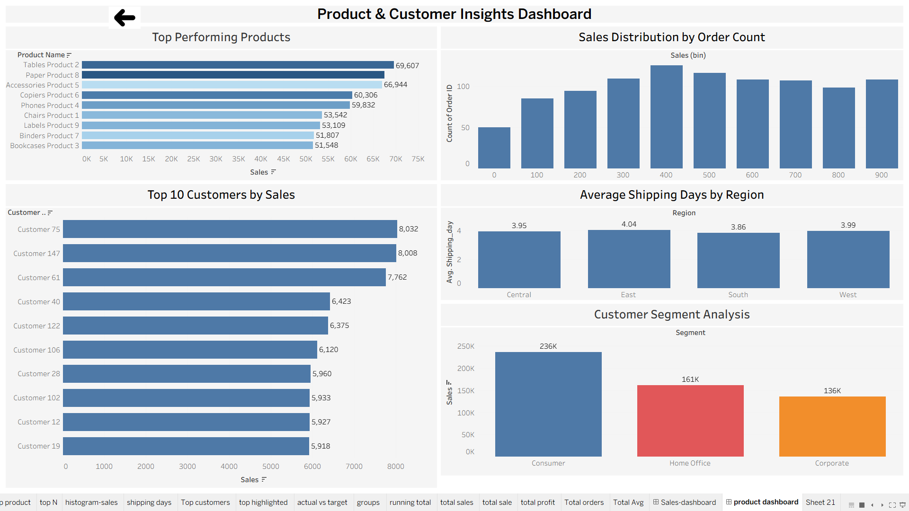

# Tableau Sales Analytics Dashboard

## Project Overview

This Tableau project provides interactive insights into sales, products, and customer performance through two interconnected dashboards.

## Problem Statement

Businesses generate large volumes of sales data, making it difficult to identify trends, monitor performance, and make informed decisions.

This project aims to:

- Track sales performance
- Monitor profitability
- Analyze customer behavior
- Identify top-performing products
- Evaluate regional performance
- Understand discount impact on profit

## Dataset Information

The dataset contains sales transaction records with the following key fields:

- Order ID
- Order Date
- Customer Name
- Product Name
- Category
- Region
- Segment
- Sales
- Profit
- Discount
- Quantity
- Shipping Days

The data was analyzed and visualized using Tableau to generate business insights and support decision-making.

## Dashboard Structure

### Dashboard 1: Sales Overview Dashboard

Features:
- Total Sales KPI
- Total Profit KPI
- Total Orders KPI
- Average Discount KPI
- Sales Trend Analysis
- Category Contribution
- Regional Sales & Profit Map
- Discount Impact on Profit

### Dashboard 2: Product & Customer Insights Dashboard

Features:
- Top Performing Products
- Top Customers by Sales
- Customer Segment Analysis
- Sales Distribution
- Average Shipping Days by Region

## Dashboard Navigation

Sales Overview Dashboard
↓
Navigation Button
↓
Product & Customer Insights Dashboard

The dashboards are connected through interactive navigation buttons for a seamless user experience.

## Key Insights

- Technology category contributes the highest share of sales.
- Consumer segment generates the highest revenue.
- Regional performance varies significantly across locations.
- Discounts have a direct impact on profitability.
- A small group of products contributes a large portion of total sales.

## Tools Used

- Tableau
- Excel

## Skills Demonstrated

- Data Cleaning
- Data Visualization
- Dashboard Design
- KPI Development
- Business Analytics

## Dashboard Preview

### Sales Overview Dashboard

### Product & Customer Insights Dashboard

## Author

Harshavardhan Gorre
